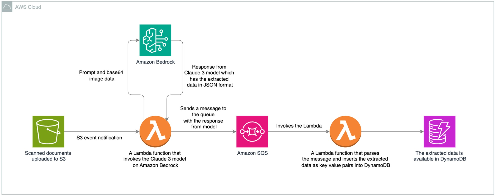

## License

This project is licensed under the MIT-0 License. See the LICENSE file for details.

# Identity Document Processing (IDP) Solution with Amazon Bedrock and Claude-3

The IDP Solution is a serverless application that automates the processing of identity documents using Amazon Bedrock's Claude-3 model. It provides intelligent document classification and data extraction capabilities, with specific optimization for birth certificate processing.

The solution leverages AWS services to create a scalable document processing pipeline. When users upload identity documents to an S3 bucket, the system automatically classifies the document type and, for birth certificates, extracts detailed information from the application forms. The extracted data is stored in DynamoDB tables for easy access and management. This automation significantly reduces manual data entry efforts and improves accuracy in document processing workflows.

This code is linked to an [AWS blog post](https://aws.amazon.com/blogs/machine-learning/intelligent-document-processing-using-amazon-bedrock-and-anthropic-claude/)

## Repository Structure
```
idp-genai/
├── lambda/                          # Contains Lambda function implementations
│   ├── bedrock_invoker/            # Lambda function for document processing using Claude-3
│   │   └── invoke_bedrock_claude3.py
│   └── dynamodb_inserter/          # Lambda function for storing extracted data
│       └── insert_into_dynamodb.py
└── template.yml                     # CloudFormation template defining AWS infrastructure
```

## Usage Instructions
### Prerequisites
- AWS Account with appropriate permissions
- AWS CLI installed and configured
- Python 3.12 or later
- Terraform CLI is installed. [Install Terraform](https://developer.hashicorp.com/terraform/tutorials/aws-get-started/install-cli)
- Make sure the desired foundational model (i.e. Anthropic Claude Sonnet 3) to use is enabled in Bedrock. Refer to [AWS Documentation](https://docs.aws.amazon.com/bedrock/latest/userguide/model-access-modify.html) in order to add access to foundation models.
- S3 bucket permissions for document storage
- IAM permissions for creating and managing AWS resources
- Although this solution could work in multiple regions, it has been tested in us-east-region and its recommend to use us-east-1 region.


### Installation
1. Clone the repository:
```bash
git clone <repository-url>
cd sample-serverless-bedrock-idp
```
#### Terraform
1. Make sure your AWS credentials are properly configured on the CLI
   1. If multiple CLI profile is configured, run this command to set the correct profile
```bash
export AWS_PROFILE=<profile-name>
```
   2. The credentials used in the CLI should have admin privileges (preferred) or adequate permissions to be able to create and update the resources used in this solution.
2. Init Terraform:
```bash
terraform init
```
1. Now review the resources that will be created part of this code:
```bash
terraform plan
```
1. Once you are ready, apply the changes:
```bash
terraform apply
```

#### SAM

1. Make sure your AWS credentials are properly configured on the CLI
   1. If multiple CLI profile is configured, run this command to set the correct profile export AWS_PROFILE=<profile-name>
   2. The credentials used in the CLI should have admin privileges (preferred) or adequate permissions to be able to create and update the resources used in this solution.
   
2. Deploy the CloudFormation stack:
```bash
sam deploy --guided
```

### Quick Start

1. Upload a birth certificate image to the S3 bucket:
```bash
aws s3 cp path/to/birth-certificate.jpeg s3://your-bucket-name/birth_certificates/images/
```

2. The system will automatically:
   - Extract information (for birth certificates)
   - Store the data in DynamoDB

3. Query the extracted data:
```bash
“aws dynamodb scan \
  --table-name BirthCertificates
```

### More Detailed Examples

1. Birth Certificate Data Extraction:
```python
# Example of extracted data structure
{
    "applicantDetails": {
        "applicantName": "John Doe",
        "dayPhoneNumber": "555-0123",
        "address": "123 Main St"
    },
    "BirthCertificateDetails": {
        "nameOnBirthCertificate": "John Doe",
        "dateOfBirth": "2000-01-01",
        "cityOfBirth": "Charleston"
    }
}
```

### Troubleshooting

1. Image Processing Failures
   - Error: "Invalid image format"
   - Solution: Ensure images are in supported formats (JPEG, PNG, PDF)
   - Check file permissions in S3 bucket

2. Claude-3 Model Issues
   - Error: "Model invocation failed"
   - Enable CloudWatch logs for the Lambda function
   - Verify Bedrock service permissions
   - Check model quota limits

3. DynamoDB Insertion Errors
   - Check DynamoDB table permissions
   - Verify table schema matches data structure
   - Monitor CloudWatch logs for error details
  
4. S3 bucket creation takes longer than 2 mins with “Still creating” message
   - Make sure that you provided a globally unique bucket team
   - Terminate the terraform execution by pressing Ctrl + C (in Mac) and rerun with a globally unique S3 bucket name


## Data Flow
The solution processes documents through a serverless pipeline that handles document classification and data extraction.

```ascii
Upload → S3 Bucket → Lambda (Bedrock) → Extraction → Simple Queue Service → Lambda → DynamoDB
   |                 |                       |                   |              |
   └─ Image Files    └─ Claude-3 Processing  └─ JSON Output      └─ Queue       └─ Storage
```

Key Component Interactions:
1. S3 triggers Lambda function on document upload
2. Bedrock Lambda processes image using Claude-3
3. Classification results stored directly in DynamoDB
4. Extracted data sent to SQS queue
5. Second Lambda processes queue messages
6. Structured data stored in birth certificates table
7. Error handling and retries managed by SQS

## Architecture



### Storage Resources
- S3 Bucket (DocumentBucket)
  - Versioning enabled
  - Public access blocked
- DynamoDB Tables
  - BirthCertificatesTable (Primary key: Id)

### Compute Resources
- Lambda Functions
  - InvokeBedrockFunction (Python 3.12)
  - InsertDynamoDBFunction (Python 3.12)

### Message Queue
- SQS Queue (ExtractedDataQueue)
  - 60-second visibility timeout

### IAM Roles
- InvokeBedrockRole
  - Bedrock model invocation
  - S3 read access
  - SQS message publishing
- InsertDynamoDBRole
  - DynamoDB write access
  - SQS message processing
